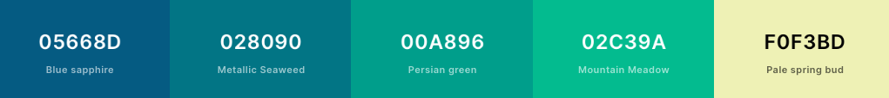
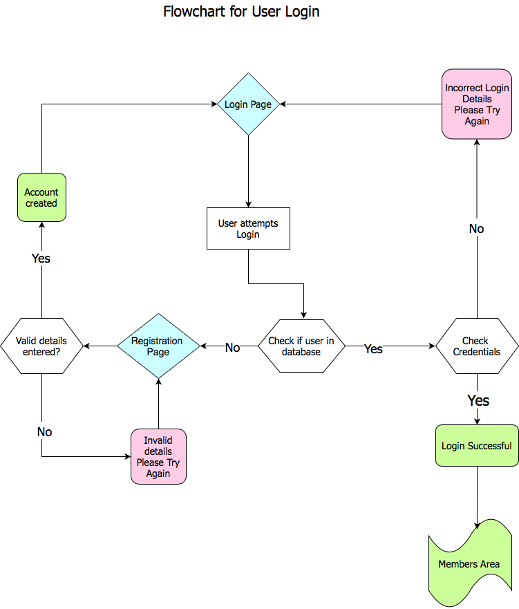

# Horzon.        
### Artisan Landscape Art and Photography

# Contents:
#### User Experience
#### Design
#### Wireframes & Flowcharts
#### Features
#### Technologies Used

# User Experience

### Project Goals

The aim of this project is to promote the clients work as an artist and photographer. The project will showcase their work as well as offereing a bespoke commission service where the user can 
request a specific work within the remit of the artist.  Users can create an account, add items to their cart and make payments ahd have their orders available to view in their Profile page.  Non-registered users can browse the gallery/shop and contact the site administrator.

### Target Audience Goals

* To introduce and promote the work of the artist
* To promote the commission service and encourage users to register
* An easy to use layout and design that works on any device
* To be able to communicate with the artist
* Be able to browse the artworks, and make Purchases
* Registered users should be able to view their profile and order history

### Client/Site Owner Goals

* Promote the work of the artist
* Generate business via comissions
* Communicate and get feedback from users
* Get inspiration from users for projects for sale

### User Stories

As a user I want to be able to navigate the site easily and be able to view the artist's work and be enticed to purchase or commission a work.  I want to be able to easily contact the 
artist and be able to get information about the service provided.

As a user I want to be able to find out information about the artist and their influences and what inspires them and their work.

As a user I want to be able to use the site whether on a mobile, tablet or desktop.

As the artist and site owner I want to encourage users to browse my work and be inspired to purchase or commission a work.

As the artist and site owner I want users to be able to easily contact me and obtain information about me and my work and feel they can ask me anything.

### User Expectations and Requirements

In today's world, users should have the confidence to shop online to shop securely and comfortably with a easy to use interface.  A simple easy use UX experience plus a secure 
payment gateway (Stripe) is the ideal solution.

### Requirements

* Interactive and helpful design
* Use the site on any device
* Learn and be able to contact the site owner and artist
* Browse the gallery/shop and be able to add products to the cart and proceed and make payment securely
* View orders and profile information
* Contact the site owner and artist with any query/information

### Expectations

* The site will store user details securely
* Payment details will not be stored on the site or associated database
* The website will load quickly
* The website will have a responsive layout and work on any device
* The site can be navigated easily

# Design

### Design philosophy

The name and overall colour scheme reflect the artist's preferred subject - landscapes.  A blend of greens and blues augmented by off white was used to reflect
the combination of land, sea and sky.  I believe this is a palette that users will relate to and expect when looking at land and seascapes.

### Fonts

I chose 2 fonts from Google Fonts fot the design, Julius Sans for titles and subtitles which I though gave a tall, but not over imposing feel and Poppins for all other text,
which I thought gave a nice rounded contrast to reflect the shapes on the landscape.

### Icons

### Colours

The following colours have been utilised throughout the site:

### Images

The images used as part of the UX are all the artist's work to keep in line the general context of the site.

# Wireframes & Flowcharts

I used Balsamiq to create the wireframes and they can be found as follows:

* [Desktop](https://github.com/stiophan0309/horizon-sah/tree/master/wireframes/desktop/)
* [Tablet](https://github.com/stiophan0309/horizon-sah/tree/master/wireframes/tablet/)
* [Mobile](https://github.com/stiophan0309/horizon-sah/tree/master/wireframes/mobile/)

The following is a flowchart of the login/registration process:

### Database Design

The following datatypes are used in the database:

* ObjectID
* String
* Boolean
* Number

Works Collection:

Name  | Database Name | Type
----- | ------------- | ----
Work ID | _id | ObjectId
Title   | title | String
Category | category | String
Image | image | String
Surface | surface | String
Media | media | String
H Size  | h_size | Number
V Size | v_size | Number
Commission | commission | Boolean
Price | price | Number

Users Collection:

Name | Database Name | Type
---- | ------------- | ----
User ID | _id | ObjectId
Name | name | String
Password | password | String
Email | email | String

Purchases Collection:

Name | Database Name | Type
---- | ------------- | ----
Purchase ID | _id | ObjectId
Name | name | String
Email | email | String
Date | date | String
Total | total | number

# Features

# Technologies Used

